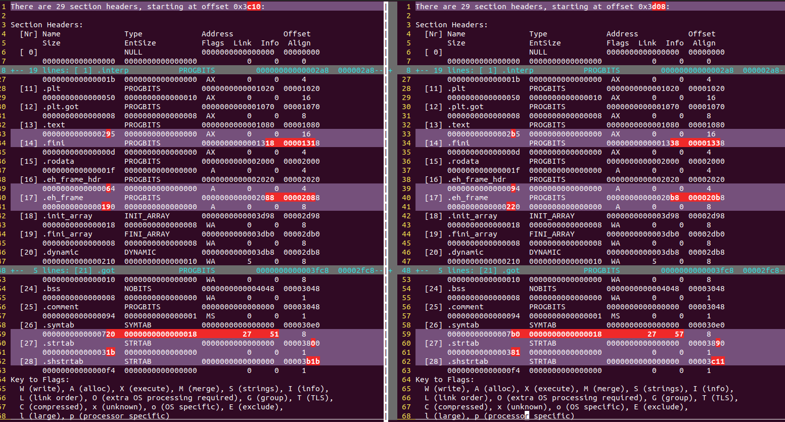
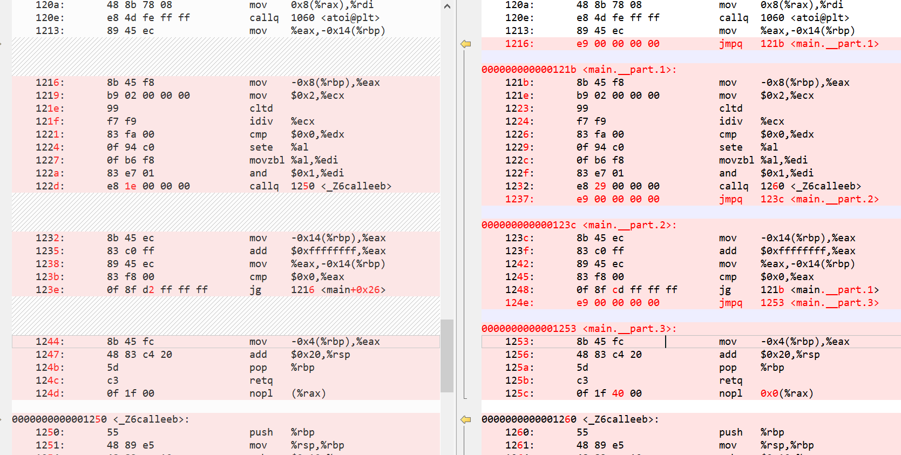
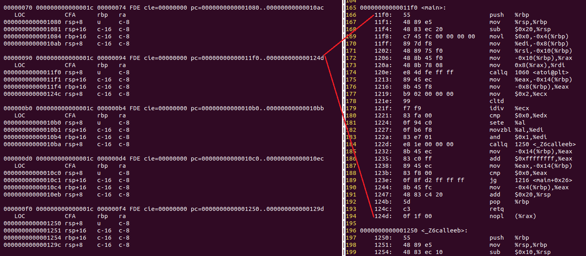
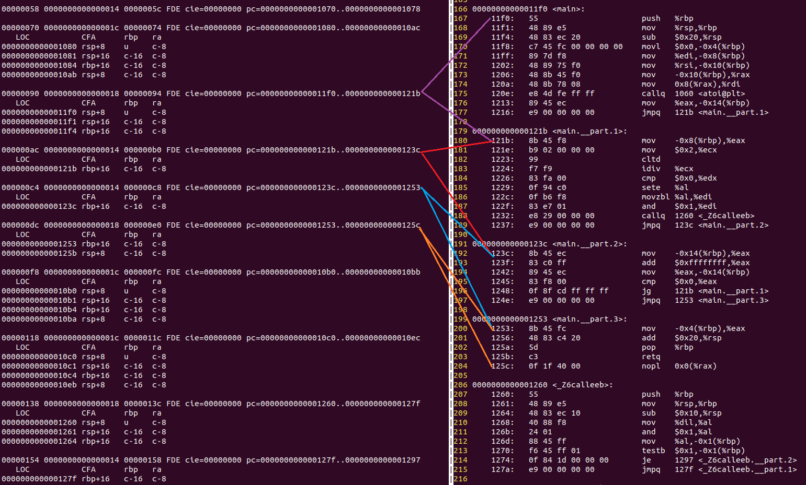

## 一、Propeller执行过程
propller是google基于LLVM开发的一个post linker optimizer，本质上是一种profile guided optimization的优化方法。propeller优化是嵌在linker中的，作为linker的一个步骤。当前profile数据的采集紧支持采样，不支持插桩。执行过程如下图：


1. 将源文件编译成可执行文件，变异过程中加入--fblock-sections=labels选项，其作用是为每个basic block生成一个symbol，该symbol用于映射perf采集的profile
2. 执行可执行文件， 并用perf采集profile
3. 转换perf数据为propeller可读数据
4. 输入中间IR，编译生成object，并执行链接，其中object的会为每个basic block生成一个section，用于在linker上做code layout。

## 二、Propeller对可执行文件codesize的影响
propeller的优化嵌在linker里，之所以可以在linker阶段做code layout，是因为compiler将函数中的每个basic block放在一个独立的section中。
在propeller RFC中，有提到propeller会导致可执行文件size增大，其中包括由于block label的存在，导致.symtab和.strtab增加，这一点容易理解。另外，由于block section的存在，会导致.eh_frame增加，之前对.eh_frame了解的不多，因此对这一点没有清晰的认识。下面就用RFC中的例子，分析为什么会导致.eh_frame的size增加。

**RFC中的用例：**

包含main.cc和callee.cc两个文件。

main.cc
```c++
#include <iostream>

int callee(bool);
int main(int argc, char *argv[]) {
    int repeat = atoi(argv[1]);
    do {
        callee(argc % 2 == 0);
    } while (--repeat > 0);
}
```
callee.c
```c++
#include <iostream>

using namespace std;

int callee(bool direction) {
    if (direction)
        cout << "True branch\n";
    else
        cout << "False brnach\n";
    return 0;
}
```

用clang分别编译出包含和不包含block sections可执行文件。编译命令如下：
```sh
~/project/llvm/build/bin/clang++ main.cc callee.cc -o a.out
~/project/llvm/build/bin/clang++ -fblock-sections=all main.cc callee.cc -o a.out.sections
```
通过命令`readelf -S a.out`查看可执行文件的sections
对比其sections，如下图：

可见，除.symtab和.strtab secction外，.text、.eh_frame_hdr和eh_frame section的size都有所增加。

通过命令`objdump -d a.out` 查看可执行文件的反汇编，对比结果如下：

.text section的增加，主要体现在block之间全部用branch指令连接。当然，这里的对比还不是真正做了propeller优化后的状态，这些在propeller优化中是有相应的branch relaxation处理的。这里主要分析对.eh_frame的影响。
 
 使用命令`readelf -wF a.out` 查看.eh_frame的内容。对比其.eh_frame的差异，如下图：
 
 不带block section的.eh_frame与text段的对应关系如下：
 
 带block section的.eh_frame与.text section的对应关系如下：
 
 这里可以看到，由于block section的存在，.eh_frame section会为每个block section分别生成对应的frame信息，由此导致frame size增加。